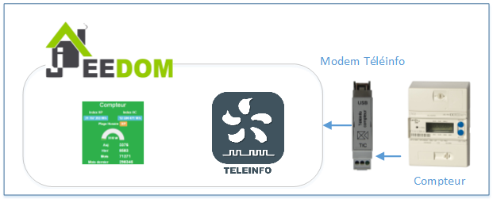
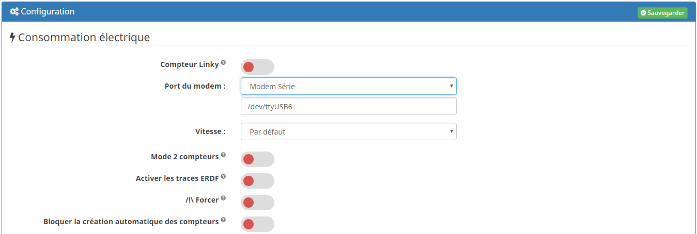
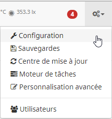

# Présentation
Le plugin Téléinformation permet de récupérer les informations de votre compteur EDF et de les afficher sur le Jeedom de votre choix. Pour cela 2 modes sont disponibles, le mode local et le mode réseau.

# Architecture
Pour récupérer la Téléinformation il faut se connecter sur les bornes I1 et I2 du compteur :

Plusieurs architectures peuvent être ensuite choisis :

# Cas d'utilisation de 2 compteurs
Dans le cas d'utilisation du modem Cartelectronic 2 Compteurs et le branchement de 2 compteurs électrique il est nécessaire d'activer le mode 2 compteurs.

# Installation
Commencer par installer le plugin depuis le market : https://www.jeedom.fr/doc/documentation/core/fr_FR/doc-core-plugin.html

Après avoir activé le plugin vous devez choisir le port du modem :

En cas d'utilisation d'un modem série il est nécessaire de renseigner son port et d'ajouter ce port au groupe dialout.

Enfin pensez à sauvegarder.

Un nouveau Protocole est disponible dans Plugins => Protocole domotique => Téléinfo

# Configuration
Le plugin offre la possibilité de créer automatiquement les commandes réceptionnées. Pour cela démarrez le daemon, attendez que les premières trames arrivent puis rendez vous sur Plugin / Protocoles Domotiques / Téléinfo.
Vous devriez voir apparaitre un objet avec un ID.
Cliquez dessus et sélectionnez "Création automatique des commandes" en haut à droite, enfin sauvegardez. A partir de ce moment toutes les commandes reçu et non reconnu seront ajoutée automatiquement.

Vous pouvez également créer votre appareil manuellement :
-   Créez votre nouvel appareil en cliquant sur Ajouter
-   Ajoutez les commandes que vous souhaitez récupérer en cliquant sur le bouton vert "Commande"
-   Vous pouvez également afficher des statistiques de consommation (Aujourd'hui / Hier / Mois en cours / Mois dernier) en cliquant sur le bouton "Ajouter une statistique"
-   Renseignez le nom affiché dans Jeedom, le Sous-Type en fonction de l'information qui sera récupérée, la donnée à récupérer et enfin les paramètres associés.
-   Cliquez sur sauvegarder.

# Les commandes
Les commandes (Ajouter une donnée) correspondent aux données envoyées par le modem.

Celles-ci peuvent êtres les suivantes :

-   Index (Base / Heures Pleines / Heures Creuses)
-   Index (Heures Normales / Heures de pointe mobile / Heures Pleines Bleu / Heures Creuses Bleu / Heures Pleine Blanc / Heures Creuses Blanc / Heures Pleines Rouge / Heures Creuses Rouge)
-   Tranche tarifaire
-   Type d'abonnement
-   Puissance instantanée
-   Intensité instantanée (Pour triphasé également)
-   Alerte dépassement (Pour triphasé également)
-   Intensité souscrite
-   Préavis EJP (30 minutes avant)
-   Couleur EJP lendemin.

# Les statistiques
Afin d'obtenir des informations sur une durée plus longue des statistiques ont étés ajoutées.
Ces statistiques correspondent aux informations suivantes :
-   Consommation du jour en cours
-   Consommation d'hier
-   Consommation du mois en cours
-   Consommation du mois précédent
-   Tendance journalière de la consommation (Pour être informé si l'on consomme plus ou moins par rapport au jour précédent à la même heure)
-   Puissance apparente : Certains compteurs ne renvoie pas l'information PAPP. Pour cela un calcul à été implémenté afin d'obtenir une moyenne de consommation en W toutes les minutes.

# Les unités
-   Les index : Watt-heure
-   Tranche tarifaire : Chaîne de caractères.
-   Puissance apparente instantanée : Volt-Ampère.
-   Les intensités : Ampère.
-   Les alertes dépassement : Ampère
-   Type d'abonnement : Chaîne de caractères.
-   Le préavis EJP et la couleur du lendemn : Chaîne de caractères.
-   La conso moyenne sur la dernière minute : Watt

# Santé
Il est possible de vérifier la réception des données avant traitement.

Pour cela rendez vous sur l'objet téléinfo puis cliquez sur Santé

La fenêtre qui s'ouvre permet de vérifier la bonne reception des données :

# API
Le plugin téléinfo met à disposition une api afin de mettre à jour les données depuis d'autres systèmes.
Il s'agit d'une URL d'appel de type GET.
Pour y accéder ces informations sont obligatoires :

URL = http://#IP_JEEDOM#:#PORT_JEEDOM#/jeedom/plugins/teleinfo/core/php/jeeTeleinfo.php?api=#VOTRE_API_JEEDOM#&ADCO=#IDENTIFIANT_DU_COMPTEUR#

 #IP_JEEDOM# correspond à l'adresse ip de votre Jeedom
 #PORT_JEEDOM# correspond au port d'accès à votre Jeedom
 #VOTRE_API_JEEDOM# est la clé API disponible depuis le menu Général / Administration / Configuration

 

 #IDENTIFIANT_DU_COMPTEUR# correspond à l'ADCO de celui-ci. Cette information est obligatoirement transmise par le compteur lorsque vous recevez une trame.

Attention le /jeedom peux être différent si vous êtes sur une installation DIY ou OEM. En règle générale il faut l'ajouter.

A cette url d'appel vous pouvez ajouter les différentes valeurs suivant le format : &#NOM_DE_LA_VALEUR#=#VALEUR#

Par exemple pour l'index d'un abonnement BASE EDF équivalent à 123456789 :

*&BASE=123456789*

L'URL sera donc surchargée de toutes information utile.

Par exemple :

    IP_JEEDOM : 192.168.1.15
    PORT_JEEDOM : 80
    VOTRE_API_JEEDOM : zertyuiolkjhgfdsxc
    IDENTIFIANT_DU_COMPTEUR : 0095123657
    Index BASE : 123456789

Donnera l'URL : http://192.168.1.15:80/jeedom/plugins/teleinfo/core/php/jeeTeleinfo.php?api=zertyuiolkjhgfdsxc&ADCO=0095123657*&BASE=123456789*

Il est possible d'envoyer toutes les informations transmises par les compteurs suivant les étiquettes définie par la norme.
Quelques unes (Les plus connues) :

	* BASE
	* HPHP
	* HPHC
	* PTEC
	* PAPP
	* IINST
	* ADPS

# FAQ

>J'ai un modem Cartelectronic qui n'envoi aucune information

Plusieurs firmwares existent pour ce modem, seul le firmware linux est compatible avec Jeedom.
Pour le mettre à jour :

ATTENTION ! Je vous conseille de lire le forum en premier afin d'être sûr d'effectuer les bonnes actions. Je ne pourrais être tenu responsable des opérations effectuées.

Télécharger le programme et le firmware ici : [http://www.cartelectronic.fr/logiciels/Modif%20teleinfo%201TIC.zip](http://www.cartelectronic.fr/logiciels/Modif%20teleinfo%201TIC.zip)
(Pour le modem 1 compteur : [http://www.cartelectronic.fr/blog/?p=1125](http://www.cartelectronic.fr/blog/?p=1125))

- Installer le logiciel FT PROG
- exécuter FT PROG
- faire un scan (loupe) pour rechercher les modules USB
- une fois le module trouvé aller dans FILE -> OPEN TEMPLATE et sélectionner le fichier : Interface USB 1 TIC SF.xml
- cliquer sur le module détecté avec le bouton droit et sélectionner appliquer template
- cliquer sur le module détecté avec le bouton droit et sélectionner programmer
- A la fin le modem peux être débranché.

>Un second équipement c'est créé lors de la mise à jour

Un nouvel équipement peut apparaitre lorsque vous montez d'une version et que l'ancienne ne contenait pas l'ADCO du compteur.
Pour récupérer l'ancien équipement :
- Copier l'ADCO du nouvel objet dans celui de l'ancien.
- Sauvegarder l'ancien.
- Supprimer le nouveau.

>Success - No result has been sent s'affiche lorsque je clique sur Tester

Cela indique que la donnée n'a pas été reçu par le plugin.
Deux cas sont possible :
- La donnée n'existe pas sur votre abonnement.
- La donnée n'as pas encore eu le temps de remonter.

Dans tous les cas il est nécessaire d'attendre 24h après l'installation du plugin pour être sûr des données qui sont reçu.

>Les statistiques restent à zero

Il est nécessaire que l'historisation des index soit activée afin de que les statistiques se calcule.
Il est possible de forcer le calcul en relancant les 2 tâches suivantes depuis le moteur de tâche :
- CalculateTodayStats
- CalculateOtherStats

>J'ai une installation DIY et je ne récupère aucune information

Il est nécessaire dans certains cas de supprimer certaines lignes du fichier /boot/cmdline.txt

Supprimer :

    console=ttyAMA0,115200 kgdboc=ttyAMA0,115200

et commenter la ligne suivante dans le fichier  /etc/inittab

    #T0:23:respawn:/sbin/getty -L ttyAMA0 115200 vt100

Depuis la version jessie le fichier inittab n'est plus présent. Il faut utiliser ces lignes de commandes :

    sudo systemctl stop serial-getty@ttyAMA0.service
    sudo systemctl disable serial-getty@ttyAMA0.service

>Comment récupérer les statistiques du plugin

Suivant l'architecture choisie les logs du plugin peuvent êtres séparés.

En mode local tous les logs se trouvent sur l'interface log de Jeedom (En mode expert : Général / Administration / Logs ; cf doc jeedom

[Accès doc](https://jeedom.fr/doc/documentation/core/fr_FR/doc-core-log.html)

En mode satellite :
- Sur le maitre : Les logs de récupération / traitement des données. Les calculs des statistiques
- Sur l'esclave : Les logs de lancement du daemon.

>Mon panel n'affiche pas les informations

Dans un premier temps cliquer sur le bouton vérifier en haut à droite du panel afin de connaître l'état des données.
Dans le cas ou une données est NOK aller sur l'objet téléinfo puis le re sauvegarder.

>Mes statistiques ne se mettent pas à jour / sont erronés

Afin que les statistiques soient calcullés il est nécessaire que les index soient historisés. Vérifier la bonne configuration de ceux-ci.
Le lissage des historiques Jeedom peut induire des valeurs statistiques erronées. Pour supprimer le lissage pour chaque index :

- Cliquer sur la petite roue à côté du bouton Tester (En mode expert)
- Aller sur l'onglet Configuration Avancée
- Dans la zone historique choisir Aucun pour le mode de lissage.
- Enregistrer

+ Bug

En cas de bug avéré du plugin il est possible d'ouvrir une issue :

[https://github.com/Jeedom-Plugins-Extra/plugin-teleinfo/issues](https://github.com/Jeedom-Plugins-Extra/plugin-teleinfo/issues)
